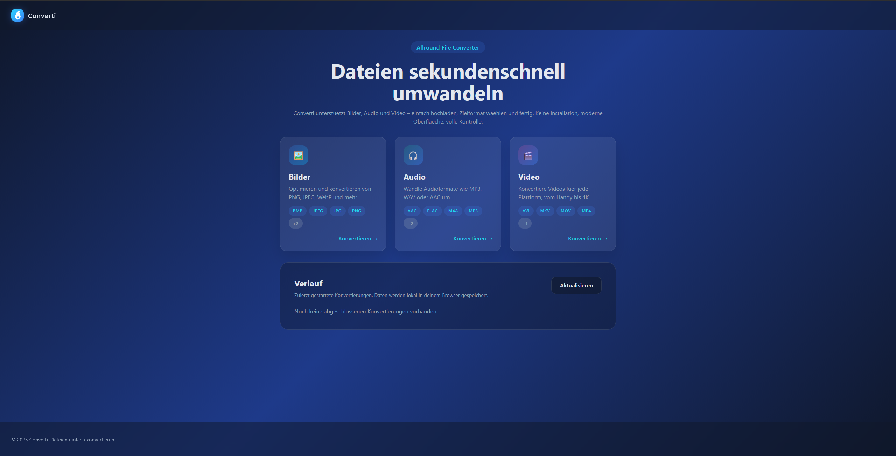

# Converti - Container Deployment



## 1. Clone the repository

```bash
git clone https://github.com/fiveraptor/converti.git
cd converti
```

## 2. Start with Docker Compose

```bash
docker compose up -d
```

Default ports:

- Frontend: http://localhost:8080
- Backend API: http://localhost:8000/api

Adjust settings directly in `docker-compose.yml`:

- `ports` - expose different local ports
- `CONVERTI_ALLOWED_ORIGINS` - allowed origins for CORS
- `CONVERTI_JOB_RETENTION_DAYS` - automatic cleanup for expired jobs (default 7 days)
- `CONVERTI_JOB_STORAGE_DIR` - location for temporary job data

Stop the stack with `docker compose down`. Converted files persist in the `backend_storage` volume. To update the containers, run `docker compose pull` followed by `docker compose up -d`.

---

## For developers

Converti is built with FastAPI (backend) and React/Vite (frontend). Supported conversions include images (Pillow) plus audio/video via FFmpeg. The browser keeps a local history of finished jobs.

### Project layout

```
converti/
+- backend/
¦  +- app/
¦  ¦  +- converters/
¦  ¦  +- config.py
¦  ¦  +- jobs.py
¦  ¦  +- main.py
¦  +- requirements.txt
+- frontend/
¦  +- src/
¦  ¦  +- components/
¦  ¦  +- pages/
¦  ¦  +- hooks/
¦  ¦  +- styles/
¦  +- package.json
¦  +- nginx.conf
+- Dockerfile.backend
+- Dockerfile.frontend
+- docker-compose.yml
```

### Backend setup

```bash
python -m venv .venv
.venv/Scripts/activate  # Windows
pip install -r backend/requirements.txt
uvicorn app.main:app --app-dir backend --reload --port 8000
```

API docs: http://localhost:8000/docs. FFmpeg must be available locally.

### Frontend setup

```bash
cd frontend
npm install
npm run dev
```

Dev server: http://localhost:5173. Set `VITE_API_BASE_URL` if you rely on a custom backend URL.

### Roadmap ideas

- Real time progress via WebSockets or Server Sent Events
- Additional converters (archives, documents, etc.)
- Authentication and persistent job storage
- Background worker queue for scaling out

### License

MIT – feel free to adapt Converti for your own projects.
